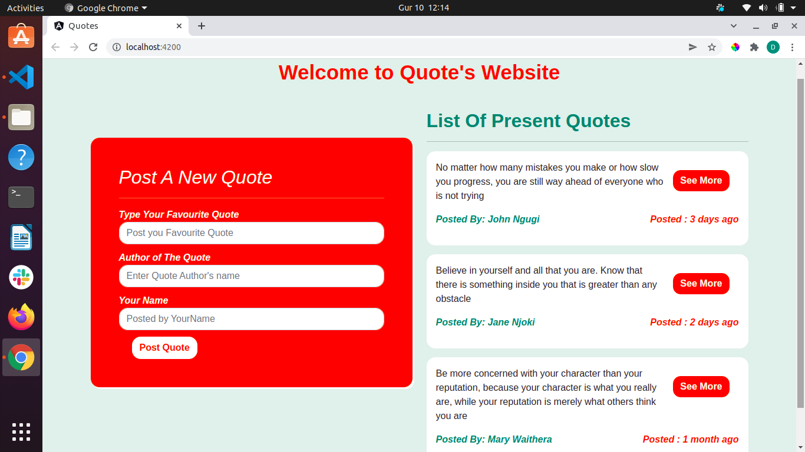

# Quotes
## By Daniel Njoroge

## Description
It is a Quotes project that allows one to be able to view existing quotes, add a new quote ,author of the quote and the name of the person posting. It also allows one to be able to vote for the quotes by clicking like button for upvote and dislike button for the downvote. It also populates time that has passed since the quote was posted.

#Screenshots of interface

## Installation And Setup Requirements
* Have a computer connected to the internet with browser and code editor installed.
* Open Terminal in your computer
* Clone the repository to your machine from https://github.com/danknjoroge/Quotes.git
* Open application using code editor of your choice preferrably atom or visual studio.
* Run ng serve --open to run application withand opens on your browser.
* Alternatively, you can use the live link provided under the live-link section which only requires network connection and computer with any browser.

## Live link
https://danknjoroge.github.io/Quotes/

## Technologies and Software Used
* HTML
* CSS
* Bootstrap
* Typescript

## Known Issues and Bugs
The project is not able to highlight quote with high upvote/downvote

## Support And Contact Information
For any Querries and support you can reach me via my email address:
* dank8505@gmail.com

## License
Tis project is under [MIT](LICENSE).

